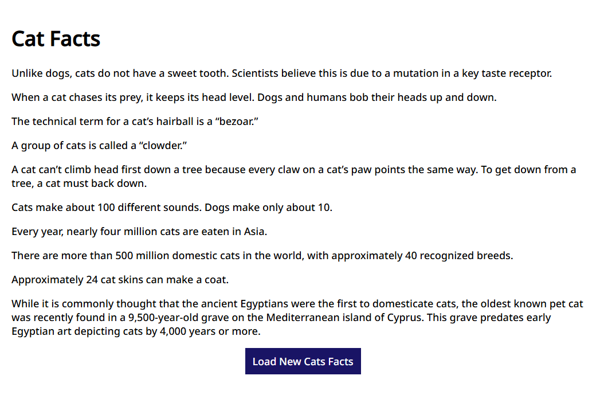
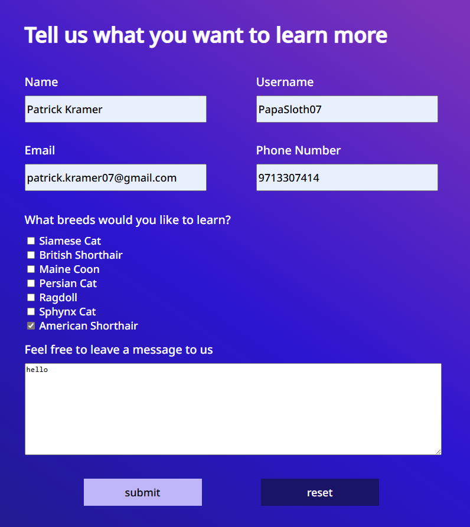

# Code Review Exercise

Write your code review here in markdown format.

## Issue #1: Button not loading new info to page

The issue, why this is an issue, and the solution:

The "Load New Cat Facts" button clears all the initially listed facts, but does not load any new facts to show the user. This is because the page changes the class of the loading-container used to generate the facts on first launch to 'display-non', removing loading-container entirely. Then, when the button triggers another call of fetchCatFacts, there is no loading-container class to reference and there is an attempt to read null. The solution is to replace the line that changes the class to display-none to one that adds a new class to the div, and then remove that class at times where we want it visible again.

Initial cat facts:



Missing cat facts after button press:


Initial code:

html:

```html
<div id="CatFacts" class="content-container">
    <h1>Cat Facts</h1>
    <div class="loading-container"></div>
    <div id="cat-facts-list"></div>
    <a class="reload-cat-facts">Load New Cats Facts</a>
</div>
```

javascript:

```js
const createLoadingContainer = function () {
  const loadingContainer = document.querySelector('.loading-container');
  const loader = document.createElement('img');
  loader.src = '../../images/loader.gif';
  loader.alt = 'loader gif while the data loads';
  loader.width = 60;
  loader.height = 60;
  loadingContainer.append(loader);
};

const fetchCatFacts = async function () {
  const catFactsList = document.getElementById('cat-facts-list');
  catFactsList.replaceChildren();

  createLoadingContainer();

  try {
    const response = await fetch('https://catfact.ninja/facts?limit=10');
    const data = await response.json();

    data.data.forEach((element) => {
      const catFactItem = document.createElement('p');
      catFactItem.setAttribute('class', 'cat-fact-list-item');
      catFactItem.textContent = element.fact;
      catFactsList.append(catFactItem);
    });
  } catch (error) {
    console.error('Error fetching cat facts:', error);
  } finally {
    const loading = document.querySelector('.loading-container');
    loading.setAttribute('class', 'display-none');
  }
};

fetchCatFacts();

document
  .querySelector('.reload-cat-facts')
  .addEventListener('click', fetchCatFacts);
```

Updated code:

html:

```html
<div id="CatFacts" class="content-container">
    <h1>Cat Facts</h1>
    <div class="loading-container"></div>
    <div id="cat-facts-list"></div>
    <a class="reload-cat-facts">Load New Cats Facts</a>
</div>
```

javascript:

```js
const createLoadingContainer = function () {
  const loadingContainer = document.querySelector('.loading-container');
  const loader = document.createElement('img');
  loader.src = '../../images/loader.gif';
  loader.alt = 'loader gif while the data loads';
  loader.width = 60;
  loader.height = 60;
  loadingContainer.append(loader);
};

const fetchCatFacts = async function () {
  const catFactsList = document.getElementById('cat-facts-list');
  catFactsList.replaceChildren();

  createLoadingContainer();

  try {
    const response = await fetch('https://catfact.ninja/facts?limit=10');
    const data = await response.json();

    data.data.forEach((element) => {
      const catFactItem = document.createElement('p');
      catFactItem.setAttribute('class', 'cat-fact-list-item');
      catFactItem.textContent = element.fact;
      catFactsList.append(catFactItem);
    });
  } catch (error) {
    console.error('Error fetching cat facts:', error);
  } finally {
    const loading = document.querySelector('.loading-container');
    loading.classList.add('display-none');
  }
};

fetchCatFacts();

document
  .querySelector('.reload-cat-facts')
  .addEventListener('click', fetchCatFacts);
```

## Issue #2: Form buttons not functioning

The issue, why this is an issue, and the solution:

The form at the bottom of the page has a submit and reset button that both do not work. This makes the form unfunctional. It happens because the div/class that contains the buttons is listed right after the end of the form, so the buttons are not within the form field and can't interact with the inputs. By moving the div containing the buttons to right before the end of the form field, the buttons now work.

Initial cat facts:



Initial code:

```html
<div class="dark-background-container">
    <form id="RequestInfo" class="content-container form">
    <h1>Tell us what you want to learn more</h1>
    <div
        class="space-between-distributed-row-container vertically-stacked-sm-screen-container"
    >
        <p class="label-input-group form-element-container">
        <span class="form-label">Name</span>
        <input
            aria-label="name"
            class="form-input-box"
            type="text"
            id="name"
            name="name"
        />
        </p>
        <p class="label-input-group form-element-container">
        <span class="form-label">Username</span>
        <input
            aria-label="username"
            class="form-input-box"
            type="text"
            id="username"
            name="username"
        />
        </p>
    </div>
    <div
        class="space-between-distributed-row-container vertically-stacked-sm-screen-container"
    >
        <p class="label-input-group form-element-container">
        <span class="form-label">Email</span>
        <input
            aria-label="email"
            class="form-input-box"
            type="email"
            id="email"
            name="email"
        />
        </p>
        <p class="label-input-group form-element-container">
        <span class="form-label">Phone Number</span>
        <input
            aria-label="phone"
            class="form-input-box"
            type="tel"
            id="phone-number"
            name="phone-number"
        />
        </p>
    </div>
    <div class="form-fieldset form-element-container">
        <p class="form-label">What breeds would you like to learn?</p>
        <div>
        <input type="checkbox" id="siamese" name="breed1" value="siamese" />
        <label for="siamese">Siamese Cat</label>
        </div>
        <div>
        <input
            type="checkbox"
            id="british-shorthair"
            name="breed2"
            value="british-shorthair"
        />
        <label for="british-shorthair">British Shorthair</label>
        </div>
        <div>
        <input
            type="checkbox"
            id="maine-coon"
            name="breed3"
            value="maine-coon"
        />
        <label for="maine-coon">Maine Coon</label>
        </div>
        <div>
        <input
            type="checkbox"
            id="persian-cat"
            name="breed4"
            value="persian-cat"
        />
        <label for="persian-cat">Persian Cat</label>
        </div>
        <div>
        <input type="checkbox" id="ragdoll" name="breed5" value="ragdoll" />
        <label for="ragdoll">Ragdoll</label>
        </div>
        <div>
        <input
            type="checkbox"
            id="sphynx-cat"
            name="breed6"
            value="sphynx-cat"
        />
        <label for="sphynx-cat">Sphynx Cat</label>
        </div>
        <div>
        <input
            type="checkbox"
            id="american-shorthair"
            name="breed"
            value="american-shorthair"
        />
        <label for="american-shorthair">American Shorthair</label>
        </div>
    </div>
    <label class="form-label" for="message"
        >Feel free to leave a message to us</label
    >
    <textarea
        class="form-textarea form-element-container"
        name="message"
        id="message"
        cols="30"
        rows="10"
    ></textarea>
    </form>
    <div
    class="form space-evenly-distributed-row-container form-buttons-container"
    >
    <input class="form-button" type="submit" value="submit" />
    <input class="form-button" type="reset" value="reset" />
    </div>
</div>
```

Updated code:

```html
<div class="dark-background-container">
    <form id="RequestInfo" class="content-container form">
    <h1>Tell us what you want to learn more</h1>
    <div
        class="space-between-distributed-row-container vertically-stacked-sm-screen-container"
    >
        <p class="label-input-group form-element-container">
        <span class="form-label">Name</span>
        <input
            aria-label="name"
            class="form-input-box"
            type="text"
            id="name"
            name="name"
        />
        </p>
        <p class="label-input-group form-element-container">
        <span class="form-label">Username</span>
        <input
            aria-label="username"
            class="form-input-box"
            type="text"
            id="username"
            name="username"
        />
        </p>
    </div>
    <div
        class="space-between-distributed-row-container vertically-stacked-sm-screen-container"
    >
        <p class="label-input-group form-element-container">
        <span class="form-label">Email</span>
        <input
            aria-label="email"
            class="form-input-box"
            type="email"
            id="email"
            name="email"
        />
        </p>
        <p class="label-input-group form-element-container">
        <span class="form-label">Phone Number</span>
        <input
            aria-label="phone"
            class="form-input-box"
            type="tel"
            id="phone-number"
            name="phone-number"
        />
        </p>
    </div>
    <div class="form-fieldset form-element-container">
        <p class="form-label">What breeds would you like to learn?</p>
        <div>
        <input type="checkbox" id="siamese" name="breed1" value="siamese" />
        <label for="siamese">Siamese Cat</label>
        </div>
        <div>
        <input
            type="checkbox"
            id="british-shorthair"
            name="breed2"
            value="british-shorthair"
        />
        <label for="british-shorthair">British Shorthair</label>
        </div>
        <div>
        <input
            type="checkbox"
            id="maine-coon"
            name="breed3"
            value="maine-coon"
        />
        <label for="maine-coon">Maine Coon</label>
        </div>
        <div>
        <input
            type="checkbox"
            id="persian-cat"
            name="breed4"
            value="persian-cat"
        />
        <label for="persian-cat">Persian Cat</label>
        </div>
        <div>
        <input type="checkbox" id="ragdoll" name="breed5" value="ragdoll" />
        <label for="ragdoll">Ragdoll</label>
        </div>
        <div>
        <input
            type="checkbox"
            id="sphynx-cat"
            name="breed6"
            value="sphynx-cat"
        />
        <label for="sphynx-cat">Sphynx Cat</label>
        </div>
        <div>
        <input
            type="checkbox"
            id="american-shorthair"
            name="breed"
            value="american-shorthair"
        />
        <label for="american-shorthair">American Shorthair</label>
        </div>
    </div>
    <label class="form-label" for="message"
        >Feel free to leave a message to us</label
    >
    <textarea
        class="form-textarea form-element-container"
        name="message"
        id="message"
        cols="30"
        rows="10"
    ></textarea>
        <div class="form space-evenly-distributed-row-container form-buttons-container">
            <input class="form-button" type="submit" value="submit" />
            <input class="form-button" type="reset" value="reset" />
        </div>
    </form>

</div>
```
